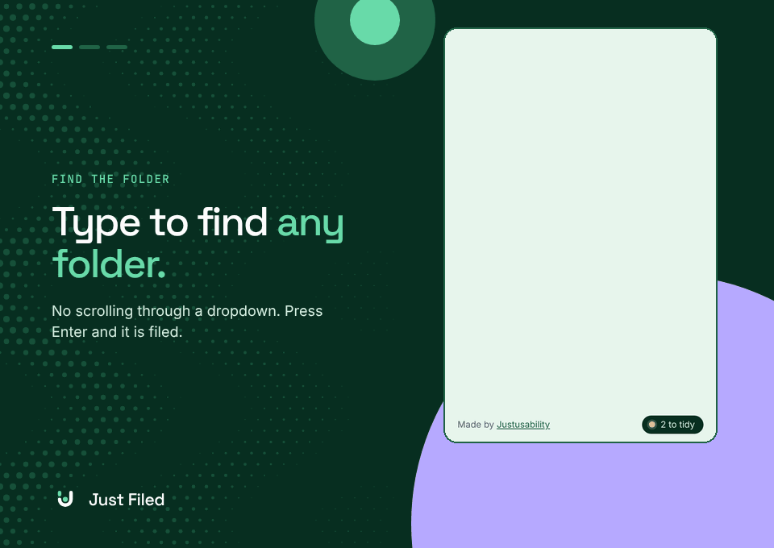

# Just Filed

**No head scratching. Just filed.**

<p align="center"></p>

Chrome's bookmark bubble makes you scroll a dropdown to find a folder. Just Filed gives you a search box instead: type a few letters to find any folder, or type a new name to create one, and press Enter. It also lists the folders the page most likely belongs in.

**[Add to Chrome from the Chrome Web Store](https://chromewebstore.google.com/detail/just-filed-ai-bookmark-fo/nikgadakbbbnaelaedjkaflpodafjmgm)**

Made by [Justusability](https://www.justusability.com/). Free and open source.

## What it does

- **Find a folder by typing.** Every word you type is matched against folder names and their parents.
- **Create a folder on the spot.** Type a name that does not exist and choose "Create". Type `Parent / Name` to put it somewhere specific.
- **Works after the star, or instead of it.** If the page is already bookmarked, Just Filed moves it. If not, it saves the page straight into the folder you pick.
- **Suggests folders** using an AI model that runs on your computer, plus where you have been saving lately and where the same site already lives.
- **Notices a misfiled bookmark.** If a page clearly belongs in a different part of your library from where it landed, Just Filed opens and says so.
- **Interrupts only when it is confident** that another folder clearly beats where the bookmark landed. Otherwise it waits for you to open it (Alt+Shift+F).
- **Tidies up what is already there.** Tidy up opens in Chrome's side panel and goes through bookmarks that look out of place, and loose ones with a likely home, one at a time: move, keep or skip. The panel stays open while you browse, so **Open** shows the page beside it, and it picks up where you left off.
- **Undo** on every action, including removing a folder it just created.

## Privacy

Everything runs in your browser. There is no server, no account and no analytics, and the extension makes no network requests: the AI model is bundled with it.

| Permission | Why |
|---|---|
| `bookmarks` | Read your folders and file the bookmark |
| `storage` | Remember settings and what it has learned, on this device only |
| `activeTab` | Read the title and address of the page you are on, only when you open Just Filed |
| `offscreen` | Keep the AI model loaded in a hidden page so answers are instant |
| `sidePanel` | Show Tidy up in Chrome's side panel, so it stays open while you browse |

## The AI model

Just Filed bundles [all-MiniLM-L6-v2](https://huggingface.co/sentence-transformers/all-MiniLM-L6-v2) (quantised, 23 MB, Apache 2.0) and runs it with [ONNX Runtime Web](https://onnxruntime.ai/) (MIT). It turns each bookmark title and folder name into a vector so pages can be matched to folders by meaning, not only by shared words.

- The first run reads your library once: about 25 seconds for 1,200 bookmarks. Results are cached on your device.
- After that, a new page is scored in under a tenth of a second.
- If the model cannot run, Just Filed falls back to its rules and still works.

## How folders are ranked

`src/ranker.js` scores every folder on five signals:

| Signal | Example reason shown |
|---|---|
| You saved into the folder recently, so you are probably on the same task | "The folder you saved to last" |
| Other bookmarks from the same site are already in the folder | "3 other bookmarks from nngroup.com" |
| The folder's name appears in the page title or address | "Folder name matches “accessibility”" |
| The page shares vocabulary with bookmarks already in the folder | "Similar to bookmarks already here" |
| You have filed this site in the folder before | "You filed figma.com here before" |

Recency fades with time: it counts for a lot within minutes of your last save and for little by the next day.

The ranker is a set of pure functions with no Chrome APIs, so it runs under Node for testing and is combined with the AI model's scores in `src/semantic.js`.

## How well it works

Measured by replaying one real library (1,187 bookmarks, 264 folders, five years) in date order, hiding each bookmark and asking where it belongs:

| | |
|---|---|
| Chrome's default (the last folder used) is right | 39% |
| Right folder is one click away with Just Filed | 66% |
| Saves where Just Filed opens by itself | about 1 in 7 |
| The bookmark really was in the wrong folder when it did | 95% |
| The right folder was among its three options when it did | 53% |

So it is good at noticing that something is in the wrong place, and right about where it should go roughly half the time. The search box covers the rest.

This is one person's library, and the thresholds were tuned on it, so expect different numbers on yours. Folders organised by project are harder to predict than folders organised by topic, because the page does not say which project it was saved for.

## Install

Get it from the [Chrome Web Store](https://chromewebstore.google.com/detail/just-filed-ai-bookmark-fo/nikgadakbbbnaelaedjkaflpodafjmgm). Updates arrive automatically.

### From source

1. Download or clone this repository.
2. Open `chrome://extensions` and switch on **Developer mode**.
3. Click **Load unpacked** and choose this folder.
4. Pin Just Filed to the toolbar, then bookmark a page.

Needs Chrome 127 or later. There is no build step.

## Develop

```
npm test
```

runs the ranking tests (Node 20 or later, no dependencies).

| Path | Purpose |
|---|---|
| `manifest.json` | Manifest V3 definition |
| `background.js` | Service worker: listens for new bookmarks, ranks, learns |
| `src/ranker.js` | Folder ranking |
| `src/semantic.js` | Matching by meaning, combined with the rules |
| `ai/` | The bundled model, tokenizer and runtime |
| `popup/` | The pane: search, suggestions, welcome, settings |
| `panel/` | Tidy up, in the side panel |
| `src/picker.js`, `src/ui.js` | The folder picker and other pieces the pane and the panel share |

## Roadmap

- Suggest a new folder when nothing fits.
- Reorganise a whole bookmark library, with preview, backup and undo.

## Credits

- "Hand drawn arrow" by Max Miner from [Noun Project](https://thenounproject.com/browse/icons/term/hand-drawn-arrow/), [CC BY 3.0](https://creativecommons.org/licenses/by/3.0/)
- [all-MiniLM-L6-v2](https://huggingface.co/sentence-transformers/all-MiniLM-L6-v2), Apache 2.0
- [ONNX Runtime Web](https://onnxruntime.ai/), MIT
- Space Grotesk, Inter and JetBrains Mono, SIL Open Font License

## Licence

MIT. The bundled fonts (Space Grotesk, Inter, JetBrains Mono) are under the SIL Open Font License; see `fonts/`.
